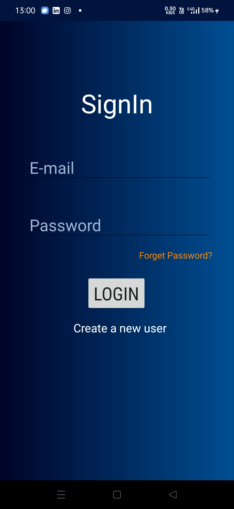
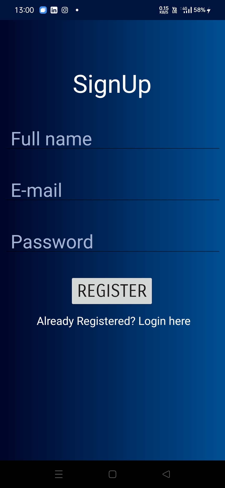
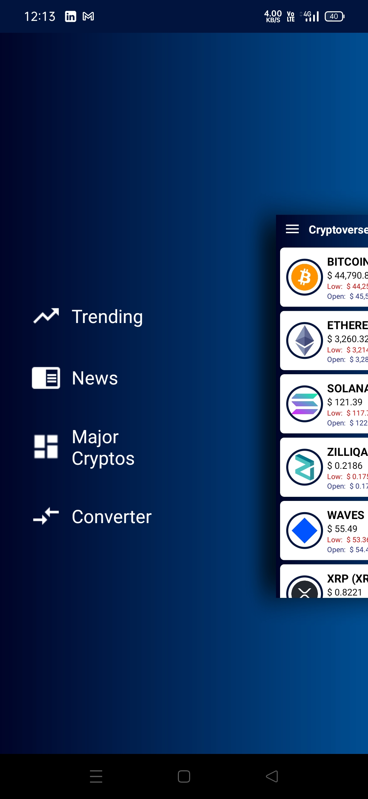
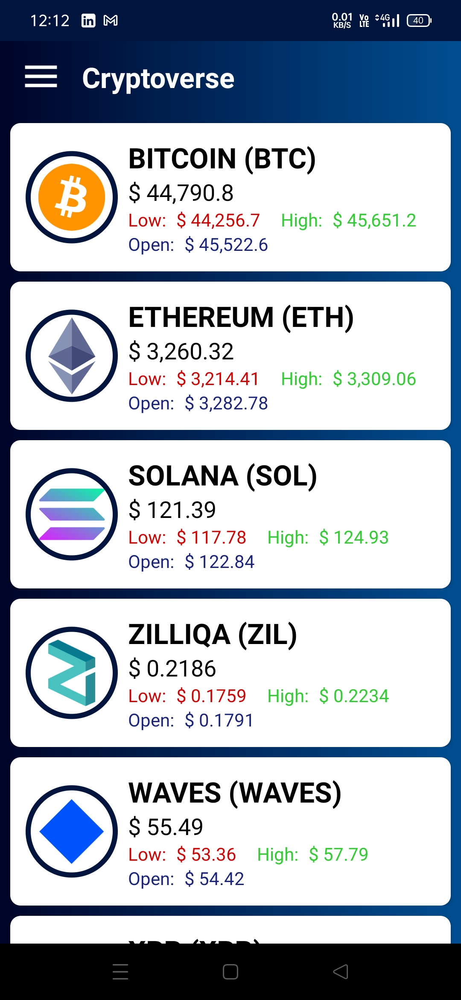
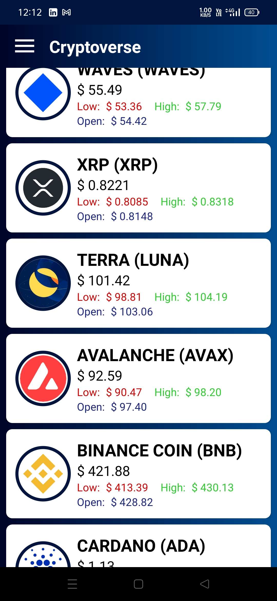
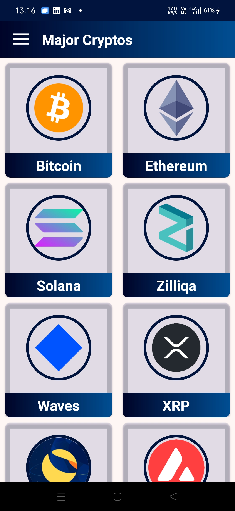
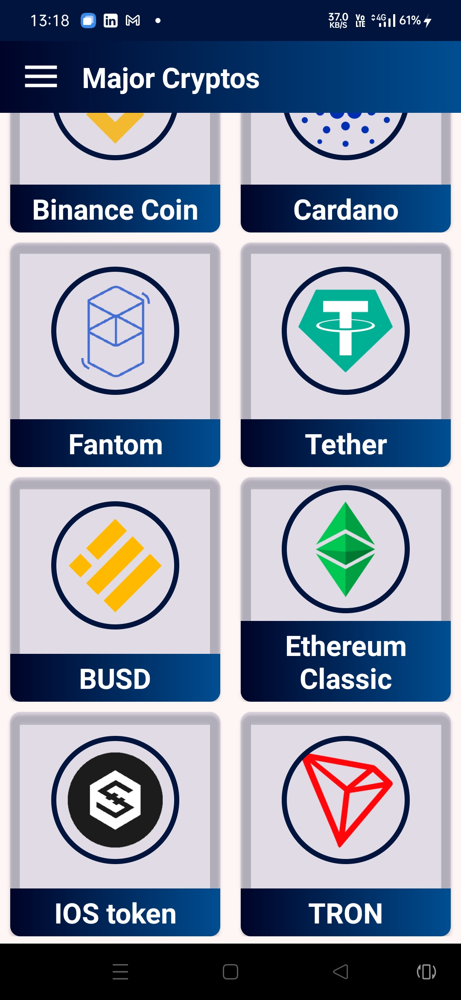
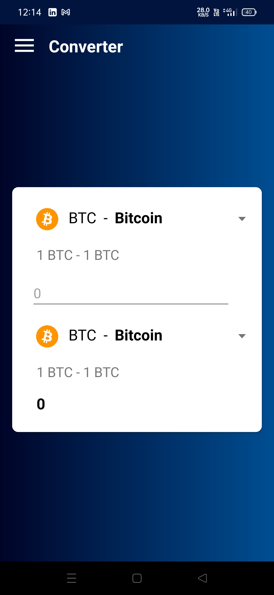

# CryptoApp

An app for Cryptocurrency prices, trends, conversions and latest news.

It uses [CryptoCompare API](https://min-api.cryptocompare.com).

## Screenshots
<table>
    <tr>
        <td></td>
        <td></td>
        <td></td>
    </tr>

<tr>
        <td></td>
        <td></td>
        <td></td>
    </tr>
    <tr>
        <td></td>
        <td></td>
        <td></td>
    </tr>

<tr>
        <td></td>
        <td></td>
    </tr>

</table>

## How to launch the project locally
1. Download **[Android Studio](https://developer.android.com/studio/index.html)** from the Google Developers site or using this [link](https://developer.android.com/studio/index.html).
2. Install the file to your pc.
3. Download the required **SDK(Standard Development Kit) Tools** .
4. **[Clone the repository](https://github.com/jainishank733/CryptoApp.git)** from : "https://github.com/jainishank733/CryptoApp.git" .

5. Open the project in Android Studio.
6. For launching the project you can either :
1. **Install emulator**
   * You can download it at the time of installation of the Android Studio or install it afterwards in the **SDK manager**.
   * Use your **AVD manager** for launching the app.
2. **Use your Android Phone**
   * For using your phone, firstly connect your Android Phone with the pc using a data cable.
   * Go to the Settings > Developers Setting.
   * **Allow USB debugging**.
   * **Run** the project from the Android Studio IDE.

